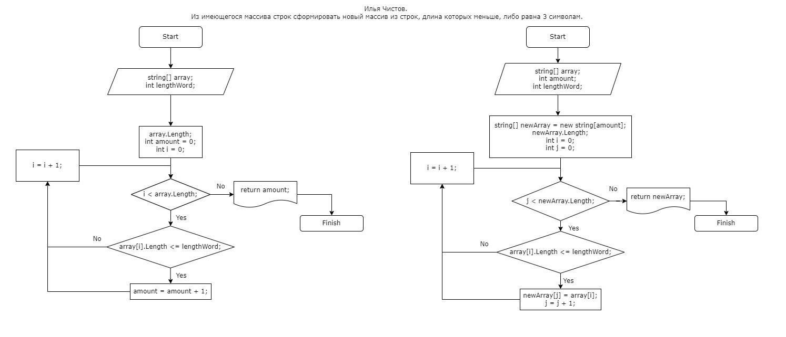

# Решение задачи

1. С помощью функции **FindAmountWordsInArray** мы находим количество строк в массиве, которые меньше, либо равны 3 символам и возвращаем это число.
2. С помощью функции **SortedArray** мы создаём новый массив размером, равным найденному количеству строк, записываем в него все строки меньше, либо равные 3 символам, после чего возвращаем этот массив.
3. С помощью функции **PrintArray** мы выводим массив со всеми строками меньше, либо равными 3 символам, либо выводим сообщение о том, что в данном массиве нет таких строк.
4. С помощью функции **PrintTask** мы выводим заданный массив, рассчитываем колличество строк (**FindAmountWordsInArray**), рассчитываем новый массив (**SortedArray**), и выводим решение из **PrintArray**.

> ## **Примечание**: 
> Задачу можно было решить куда легче одной функцией с помощью **Array.Resize**, объеденив **FindAmountWordsInArray** и **SortedArray**, но так как в программе такой функции не было в упоминании, то я решил задачу таким образом, но тоже рабочим :)

# Блок-схема решения задачи
